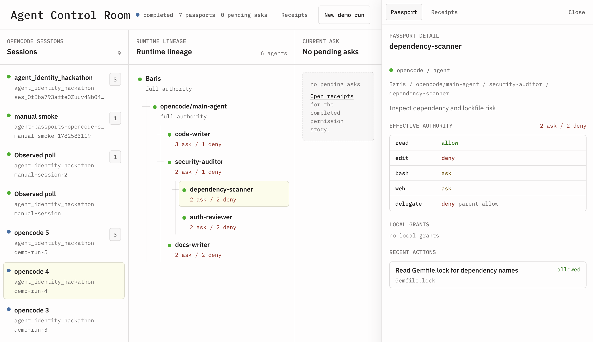

# Agent Identity Control Room

Observe agent sessions on your computer, inspect agent and subagent lineage, pause risky tool actions, approve or deny requests, grant scoped permissions, and review tamper-evident audit receipts.



The v1 prototype is OpenCode-first: a Rails control room plus an OpenCode observer. The core model is runtime-neutral, and the app now has concrete demo launch adapters for OpenCode, Claude Code, and Codex through the same event contract.

## Quick Start

Install dependencies and start the local control room:

```bash
bin/setup --skip-server
bin/dev
```

Install the machine-wide OpenCode observer once:

```bash
bin/install_opencode_observer
```

Open the control room URL:

```bash
bin/find_server_port --url
```

Then start `opencode` from any project on this computer. The session appears in the left sidebar. Click a session to inspect its lineage, current ask, passport details, and receipts.

The observer is fail-open when the Rails app is offline, so stopping Agent Control Room does not break normal OpenCode usage.

## Contributor Quick Start

1. Read `docs/runtime_adapters.md` to understand the runtime-neutral event boundary.
2. Run `bin/setup --skip-server` and `bin/dev`.
3. Open the local URL from `bin/find_server_port --url`.
4. Run `bin/rails test:all` before opening a PR. Node must be available for the JavaScript bridge tests.
5. Keep runtime-specific work inside adapters, not the passport or authorization core.

## What It Does

- Observes local OpenCode sessions from any project on this computer.
- Starts scripted demo runs through OpenCode, Claude Code, or Codex adapters.
- Shows the runtime lineage: owner, main agent, subagents, and nested subagents.
- Attaches each visible actor to a run-scoped passport that describes effective authority.
- Pauses gated tool actions until the user chooses `Allow once`, `Add to passport`, or `Deny`.
- Persists scoped grants so repeated safe actions can proceed without vague blanket approval.
- Records receipts for delegation, tool requests, decisions, grants, denials, and completions.

## Status

This is a local-first hackathon prototype.

Run it on loopback for the demo. Do not expose the Rails control room on a LAN or public host without adding app authentication.

V1 gates intent-level runtime permissions through OpenCode hooks. Claude Code and Codex currently use the shared launcher and observer contract; full per-tool permission bridges for those runtimes are the next adapter layer. This is not an OS sandbox, a secret vault, or a hosted team administration product.

## Permission Decisions

When an agent asks to run a gated action, the control room shows the actor, lineage, action, risk, and proposed scope.

- `Allow once` lets only that action continue.
- `Add to passport` saves the visible scoped grant for that agent in the current run.
- `Deny` blocks the action and writes a denial receipt.

## Scripted Demo

The scripted community demo creates a clear six-agent topology:

```text
Baris
+-- opencode/main-agent
    +-- code-writer
    +-- security-auditor
    |   +-- dependency-scanner
    |   +-- auth-reviewer
    +-- docs-writer
```

Run it from the UI with an OpenCode, Claude Code, or Codex demo button, or start the app first:

```bash
bin/setup --skip-server
bin/dev
```

Then open:

```bash
bin/find_server_port --url
```

The default demo launcher expects `opencode` on `PATH`. The UI also exposes Claude Code and Codex demo launchers. To use another binary:

```bash
AGENT_PASSPORTS_OPENCODE=/path/to/opencode bin/dev
AGENT_PASSPORTS_CLAUDE_CODE=/path/to/claude bin/dev
AGENT_PASSPORTS_CODEX=/path/to/codex bin/dev
```

To use another port:

```bash
AGENT_PASSPORTS_PORT=3010 bin/dev
```

The prototype still uses the internal `AGENT_PASSPORTS_*` environment variable prefix and `agent-passports` plugin filenames.

## Architecture

Agent Control Room has three main pieces:

- **Rails control room:** the live UI for sessions, runtime lineage, permission asks, passport details, and audit receipts.
- **Runtime adapters:** integrations that translate agent runtime events into the canonical event shape.
- **Authorization model:** passports, grants, permission requests, tool actions, and audit events.

OpenCode is the first full permission-hook adapter, not the product boundary. Runtime adapters submit canonical events such as:

- `session.started`
- `actor.delegated`
- `tool.requested`
- `tool.finished`
- `tool.blocked`
- `session.finished`

That boundary is the reason another coding-agent CLI can be added without rewriting the authorization core.

## Test

```bash
bin/rails test:all
```

Node must be available for the JavaScript bridge tests. For an intentional local opt-out, run with `SKIP_NODE_BRIDGE_TESTS=1`.

If your shell has `BUNDLE_GEMFILE` set to another repo:

```bash
env -u BUNDLE_GEMFILE -u BUNDLE_BIN_PATH bin/rails test:all
```

## Docs

- `docs/requirements.md` - constraints and launch goals.
- `docs/manifesto.md` - why this exists and what v1 refuses.
- `docs/spec.md` - v1 features, routes, and adapter boundary.
- `docs/runtime_adapters.md` - adapter interface and OpenCode/Claude Code/Codex plan.
- `docs/DESIGN.md` - OpenCode-like light-mode UI system.
- `docs/domain_model.md` - Rails model plan.
- `docs/tech_stack.md` - stack choices and verification.
- `docs/user_flows/` - Rails user flows.

## Core Rule

The agent runtime does the work. Agent Control Room observes, explains, gates, and records authority.

## What We Need Next

Agent Control Room needs contributions that turn the prototype into a dependable local control plane for real coding-agent work.

We would love help with:

- Full per-tool permission bridges for Claude Code and Codex.
- Additional runtime adapters that emit the canonical event contract.
- Stronger OpenCode hook coverage, failure handling, and adapter tests.
- Clearer passport scope previews for commands, files, network access, and project paths.
- Better UI states for empty sessions, missing runtimes, denied actions, completed runs, and long audit timelines.
- Exportable audit receipts that make post-run review and sharing easier.
- Setup and troubleshooting docs for fresh clones, different shells, and different agent CLIs.
- Security hardening for any future mode beyond loopback-only local development.

See `CONTRIBUTING.md` for setup, testing, architecture rules, and contribution guidelines.
